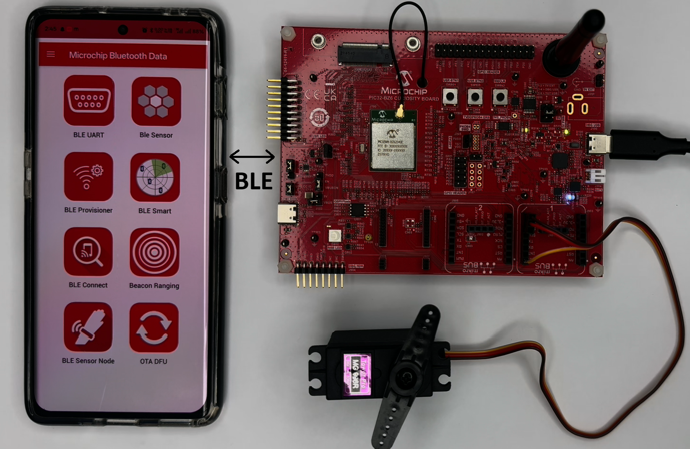
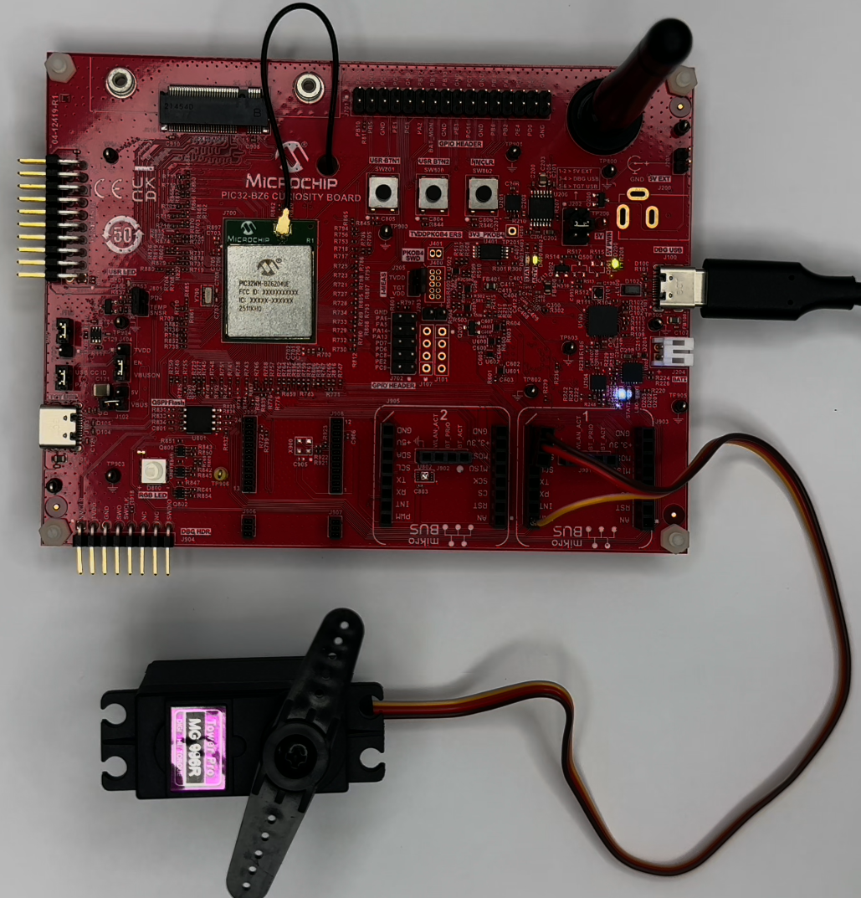
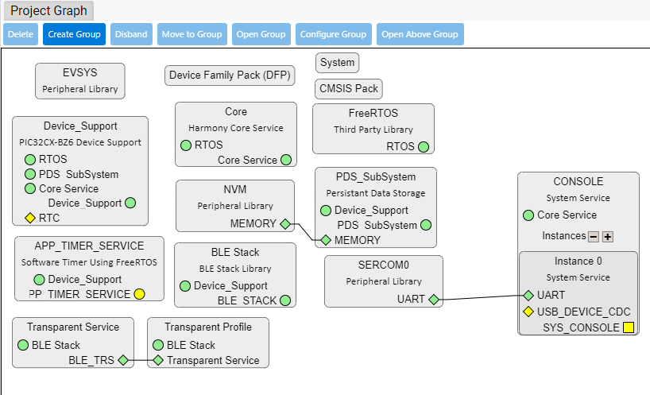
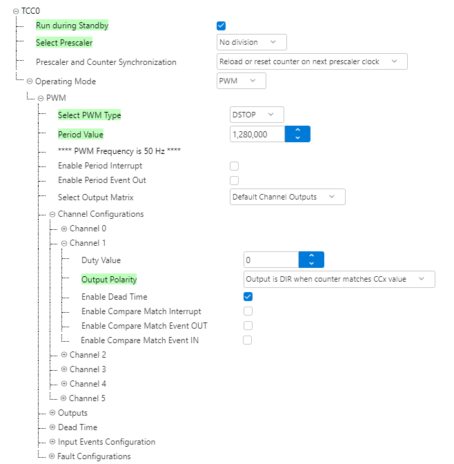
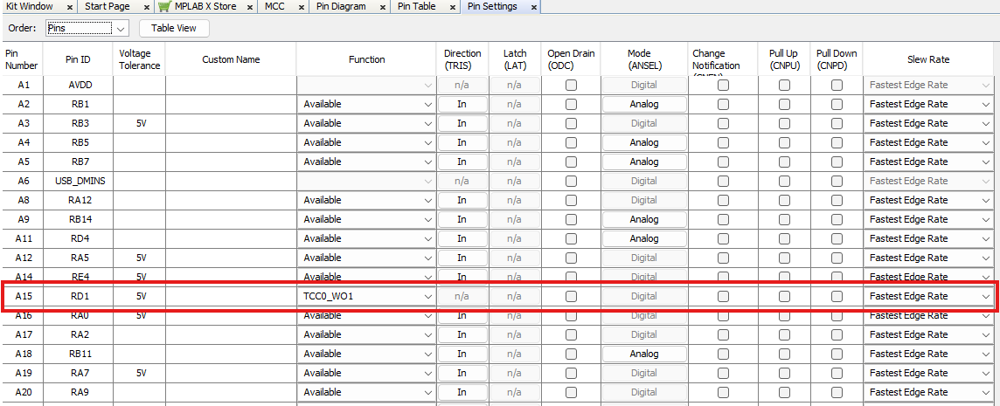

# PIC32BZ6 Bluetooth LE Servo Motor Control

> "IOT Made Easy!" 

Devices: **| PIC32CXBZ6 | PIC32BZ6 |** 
Features: **| BLE | SERVO |**

## ⚠ Disclaimer

<b>
THE SOFTWARE ARE PROVIDED "AS IS" AND GIVE A PATH FOR SELF-SUPPORT AND SELF-MAINTENANCE. This repository contains example code intended to help accelerate client product development.  

For additional Microchip repos, see: <a href="https://github.com/Microchip-MPLAB-Harmony" target="_blank">https://github.com/Microchip-MPLAB-Harmony</a>

Checkout the <a href="https://microchipsupport.force.com/s/" target="_blank">Technical support portal</a> to access our knowledge base, community forums or submit support ticket requests.

</b>

## Contents

1. [Introduction](#step1)
1. [Bill of materials](#step2)
1. [Software Setup](#step3)
1. [Hardware Setup](#step4)
1. [Harmony MCC Configuration](#step5) 
1. [Board Programming](#step6)
1. [Run the demo](#step7)

## 1. Introduction<a name="step1">

This project demonstrates a BLE-controlled 360° servo motor system built using the Microchip PIC32CXBZ6/PIC32BZ6 wireless MCU. It combines the PIC32CXBZ6 BLE stack with TCC-based PWM generation to control an MG996R servo motor through simple wireless commands such as start, stop, and reverse.

## 2. Bill of Materials<a name="step2">

| Tools | Quantity |
| :- | :- |
| [​​PIC32-BZ6 Curiosity Board](https://www.microchip.com/en-us/development-tool/ev31u42a) | 1 |
| [TowerPro MG996R 360° High Torque Servo Motor](https://amzn.in/d/g9kGrdo) | 1 |

## 3. Hardware Setup<a name="step3">

- The PWM pin from the MikroBUS™ header 1 of the PIC32-BZ6 Curiosity Board is connected to the servo motor’s PWM control pin, while the 5V and GND pins from the same header are used to power the servo motor. Refer to the image below.

## 4. Software Setup<a name="step4">

- [MPLAB X IDE ](https://www.microchip.com/en-us/tools-resources/develop/mplab-x-ide#tabs)

    - Version: 6.25
	- XC32 Compiler v4.60
	- MPLAB® Code Configurator v5.6.2
	- PIC32CX-BZ6_DFP v1.2.17
	- MCC Harmony
	  - wireless_pic32cxbz_wbz: v1.5.0
      - csp version: v3.21.0
	  - core version: v3.14.2
	  - wireless_ble: v1.4.0
      - wireless_system_pic32cxbz_wbz: v1.7.0
	  - CMSIS_5: v5.9.0
	  - FreeRTOS-Kernel: v11.1.0
	    
- Any Serial Terminal application like [TERA TERM](https://download.cnet.com/Tera-Term/3000-2094_4-75766675.html) terminal application

- [MPLAB X IPE v6.25](https://microchipdeveloper.com/ipe:installation)

## 5. Harmony MCC Configuration<a name="step5">

### Getting Started with Servo Motor application with the PIC32BZ6 Curiosity Board

| Tip | New users of MPLAB Code Configurator are recommended to go through the [overview](https://onlineDocs.microchip.com/pr/GUID-1F7007B8-9A46-4D03-AEED-650357BA760D-en-US-6/index.html?GUID-AFAB9227-B10C-4FAE-9785-98474664B50A) |
| :- | :- |

**Step 1** - Connect the PIC32BZ6 Curiosity board to the device/system using a Type-C USB cable.

**Step 2** - This application is built by using [Peripheral Transparent UART](https://github.com/Microchip-MPLAB-Harmony/wireless_apps_pic32_bz6/tree/master/apps/ble/building_blocks/peripheral/profiles_services/peripheral_trp_uart) as the building block. The changes made to the peripheral_trp_uart application is mentioned below.

| Note | The peripheral_trp_uart application repository can be cloned/downloaded from this [link](https://github.com/Microchip-MPLAB-Harmony/wireless_apps_pic32_bz6/tree/master/apps/ble/building_blocks/peripheral/profiles_services/peripheral_trp_uart). |
| :- | :- |
| File path | wireless_apps_pic32_bz6/apps/ble/building_blocks/peripheral/profiles_services/peripheral_trp_uart/firmware/peripheral_trp_uart.X |

- From project resources, go to Harmony->Peripherals and select TCC0 and configure as follows.

- In the project graph, go to plugins and select pin configuration.

**Step 3** - [Generate](https://onlinedocs.microchip.com/pr/GUID-1F7007B8-9A46-4D03-AEED-650357BA760D-en-US-6/index.html?GUID-2EE03524-41FE-4EBA-8646-6D10AA72F365) the code.

**Step 4** - Once generation is complete, the merge window will appear. Merge all the changes shown.  

**Step 5** -  Copy the mentioned files from this repository by navigating to the location mentioned below and replace the generated files.
 
| Note | This application repository should be cloned/downloaded to perform the following steps. |
| :- | :- |
| Path | The application folder can be found in the following [link](https://github.com/MicrochipTech/PIC32CXBZ6_PIC32BZ6_BLE_SERVO_MOTOR) |

- Copy the following files from the cloned repo(...\firmware\src).
	- "app.c" and "app.h"

- In "app_user_edits.c", make sure the below code line is commented 

  - "#error User action required - manually edit files as described here".

- Replace these entire files in your project folder location(...\firmware\src\app_ble).

**Step 6** - Clean and build the project. To run the project, select "Make and program device" button.

## 6. Board Programming<a name="step6">

## Programming hex file:

### Program the precompiled hex file using MPLAB X IPE

- The Precompiled hex file is given in the hex folder.
Follow the steps provided in the link to [program the precompiled hex file](https://microchipdeveloper.com/ipe:programming-device) using MPLABX IPE to program the pre-compiled hex image. 

### Build and program the application using MPLAB X IDE

The application folder can be found by navigating to the following path: 

- "firmware\peripheral_trp_uart.X"

Follow the steps provided in the link to [Build and program the application](https://github.com/Microchip-MPLAB-Harmony/wireless_apps_pic32cxbz2_wbz45/tree/master/apps/ble/advanced_applications/ble_sensor#build-and-program-the-application-guid-3d55fb8a-5995-439d-bcd6-deae7e8e78ad-section).

## 7. Run the demo<a name="step7">

- After programming the board, the expected application behavior is shown in the below [video](https://github.com/MicrochipTech/PIC32CXBZ6_PIC32BZ6_BLE_SERVO_MOTOR/blob/main/docs/Working_Demo.gif).

